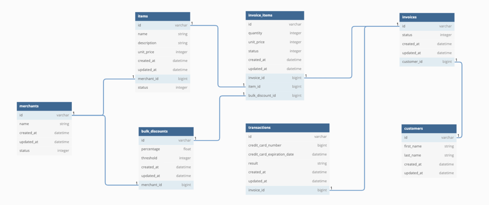

# Little Esty Shop / Bulk Discounts

[Heroku Demo](https://bulk-discounts-2203.herokuapp.com/)

## Description
This is a group project that required us to build a fictitious e-commerce platform where merchants and admins can manage inventory and fulfill customer invoices, as well as apply discounts.

## What was learned
- Practice designing a normalized database schema and defining model relationships
- Utilize advanced routing techniques including namespacing to organize and group like functionality together.
- Utilize advanced active record techniques to perform complex database queries
- Practice consuming a public API while utilizing POROs as a way to apply OOP principles to organize code

## Technologies Used
- Rails 5.2.x
- PostgreSQL
- Tested via feature tests and model tests, respectively
- GitHub branching, team code reviews via GitHub comments, and github projects to track progress on user stories
- Heroku

## Phases
1. [Database Setup](./doc/db_setup.md)
1. [User Stories](./doc/user_stories.md)
1. [Extensions](./doc/extensions.md)
1. [Evaluation](./doc/evaluation.md)
1. [Bulk Discount](https://backend.turing.edu/module2/projects/bulk_discounts)

## Schema

